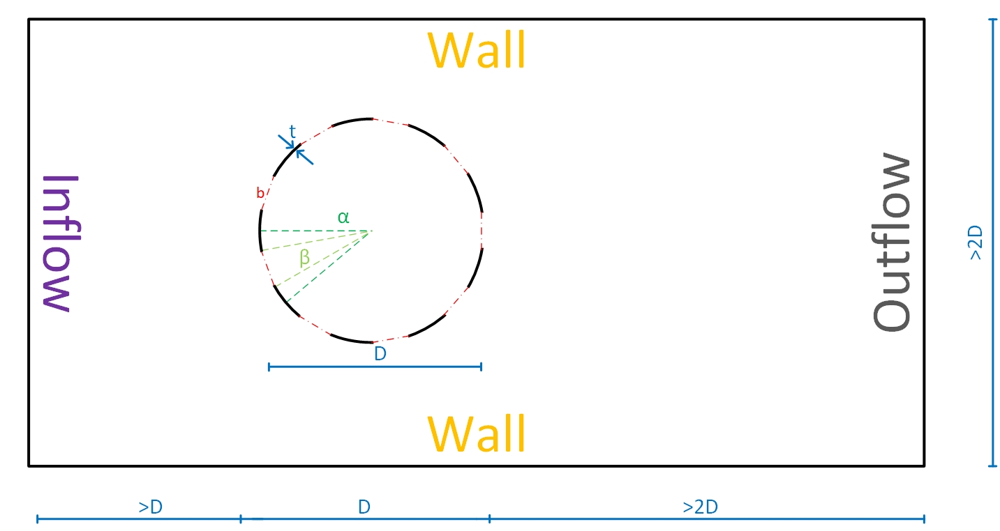
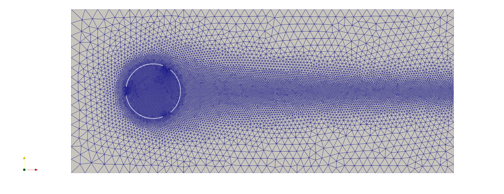

---
jupytext:
  cell_metadata_filter: -all
  formats: md:myst
  text_representation:
    extension: .md
    format_name: myst
    format_version: 0.13
    jupytext_version: 1.11.5
kernelspec:
  display_name: Python 3
  language: python
  name: python3
---

# A transient LES-VMS scheme: flow through a perforated cylinder

*Author*: [Ruben Dekeyser](https://github.com/rdeke) and [Oriol Colomés](https://github.com/oriolcg) <br>
*Published*: June 2023 <br>
*Gridap version*: [Gridap@0.17.17](https://github.com/gridap/Gridap.jl/tree/release-0.17.17)

This tutorial shows the implementation of an external mesh for a perforated cylinder in 2D in Gridap.jl. The goal is to get a time trace of the drag and lift force experienced by the monopile.


## A. Problem description

The goal is to model a steady uniform flow through a perforated cylinder. The general domain looks as follows:

<p align="center"></p>

To this end, the problem is split into a series of consecutive steps:
1. [Set up the problem](#1-setup-of-the-problem)
    1. [Define the model parameters and input values](#11-define-the-model-parameters-and-input-values)
    2. [Define the geometry](#12-define-the-geometry)
    3. [Define the boundary conditions](#13-define-the-boundary-conditions)
2. [Set up the numerical scheme](#2-set-up-the-numerical-scheme)
    1. [Set up the test spaces](#212223-set-up-the-test-and-trial-spaces-and-combine-them-into-a-transient-multifield)
    2. [Build trial spaces](#212223-set-up-the-test-and-trial-spaces-and-combine-them-into-a-transient-multifield)
    3. [Combine them in a (transient) multifield](#212223-set-up-the-test-and-trial-spaces-and-combine-them-into-a-transient-multifield)
    4. [Initialize the domain](#24-initialize-the-domain)
    5. [Define the weak form](#25-define-the-weak-form)
    6. [Set up the time integration scheme](#26-set-up-the-integration-scheme)
3. [Apply the nonlinear solver and time integration](#3-apply-the-nonlinear-solver)
4. [Do post-processing](#4-do-post-processing)

For engineering research into perforated monopiles the post processing should be built around the following data:
1. The velocity and pressure fields (usually in vtk format). This will be useful in the early stages of the development to look into the exact flow effects, eddies, ...
2. Drag and lift time-traces, either in the time or frequency domain, for further design analysis and trend-seeking.

## B. Set up of the module and surrounding parallelization options

We start by importing all required packages in a module. This module allows for easier parallel execution in cluster machines. The 2 files that are imported containt the actual Navier Stokes implementation, and the mesh generator. the latter is not elaborated on here. [However, the code can still be publically accessed.](https://github.com/rdeke/RDK_PerforatedCylinder.jl/blob/master/src/mesh_generation.jl)

```julia
using Gridap
using Gridap.FESpaces: zero_free_values, interpolate!
using Gridap.Fields: meas
using GridapGmsh: gmsh, GmshDiscreteModel
using GridapDistributed
using GridapDistributed: DistributedTriangulation, DistributedCellField
using GridapPETSc
using GridapPETSc: PETSC
using PartitionedArrays
using SparseMatricesCSR

using CSV
using DataFrames

include("NavierStokesParallel.jl")
include("mesh_generation.jl")
```

The meshes can be generated by calling a dedicated funtion, taking the different diameters, wall thicknesses, perforations, porosities, angles of attack and domain lengths as inputs. This creates meshes of all their combinations. To get a single mesh, just input 1-element lists. By changing the boolean `do_mesh` value it is possible to easily get a list of all generated files, without having to actually generate them. This is useful if one wants to re-run simulations.

```julia
function generate_meshes(; nD=[10], nRt=[100], nperf=[12], nβ=[0.5], nα=[0], nR_L=[7], do_mesh=true)
  # Create cases
  cases = []
  # RDK values
  for D in nD
    for Rt in nRt
      for num_perforations in nperf
        for β in nβ
          for α in nα
            for R_L in nR_L
                D2 =  round(D;digits=2)
                Rt2 = round(Rt;digits=0)
                β2 =  round(β;digits=2)
                α2 =  round(α,digits=2)
                filename = "D$D2-Rt$Rt2-n$num_perforations-beta$β2-alfa$α2-RL$R_L.msh"
                push!(cases,replace(filename, r".msh"=>""))

                if do_mesh==true
                  create_mesh(filename=filename, D=D, R_t=Rt, num_perforations=num_perforations, R_β=β, α=360/num_perforations*α,
                              R_L=R_L, R_Cx=R_L-5.5)
                end
              end
          end
        end
      end
    end
  end

  return cases

end
```

After that a series of `mumps` flags is defined for the module to work correctly:
```julia
options_mumps = "-snes_type newtonls \
-snes_linesearch_type basic  \
-snes_linesearch_damping 1.0 \
-snes_rtol 1.0e-8 \
-snes_atol 1.0e-10 \
-ksp_error_if_not_converged true \
-ksp_converged_reason -ksp_type preonly \
-pc_type lu \
-pc_factor_mat_solver_type mumps \
-mat_mumps_icntl_7 0"
```

Lastly the actual parallel solver can be called. The default values of the parameters allow easy execution of a warmup loop, allowing a system image to be stored on a cluster. That way the system image can be used on all calculation cores, without having to recompile the module each time. This saves multiple hours of computation time for high parallel computing.

```julia
function main_parallel(np;
  mesh_file="tmp_mesh_coarse.msh",
  vtk_outpath="tmp_mesh_coarse",
  Vinf=1,
  Δt=0.1,
  tf=1.0,
  Δtout=0.5,
  output_path=joinpath(ENV["PerforatedCylinder_DATA"],"vtk"))

  filename = replace(mesh_file, r".msh"=>"")
  run_name = filename*"-Vinf$Vinf-dt$Δt"

  current_path = pwd()
  cd(output_path)
  with_backend(MPIBackend(),np) do parts
    options = options_mumps
    GridapPETSc.with(args=split(options)) do
      run_test_parallel(parts,run_name,mesh_file,vtk_outpath,Vinf,Δt,tf,Δtout)
    end
  end
  cd(current_path)
end
```

## 1. Setup of the problem

The model gets 3 main inputs: the mesh, the inflow velocity, and the time step. The mesh is triangulated and split into a fluid and a solid domain. Additionally the boundaries are read from predefined tags from the mesh-file. The bounds of all these sub-domains are `Measured` to be used in integration schemes later, and additionally the normal directions of the structure and the outflow boundary are calculated.
The boundary conditions are: a uniform (Dirichlet) inflow of speed $V_{in}$, prescribed-velocity $(V_{in},0)$ walls and a no-slip no-penetration structure. The outflow boundary is included in the weak form directly.

<p align="center"></p>

For the code we define a more elaborate structure. 

### 1.1 Define the model parameters and input values

We start by referencing the `part`, or subdomain which we are currently in. This is needed since we are using parallel computing, and this way the differenc processors can communicate with each other by sharing their outputs. Additionally, while this can be omitted, we generate files to log the progress. Also we generate a file to store the force outputs.

```julia
if i_am_main(parts)

    logs_path=ENV["PerforatedCylinder_LOGS"]
    log_file = run_name*"-output.log"
    full_logs_path = joinpath(logs_path,log_file)
    io = open(full_logs_path, "w")

    forces_path=ENV["PerforatedCylinder_FORCES"]
    force_file=run_name*"-forces.csv"
    full_force_path = joinpath(forces_path,force_file)
    io_force = open(full_force_path, "w")

  end

  function to_logfile(x...)
    if i_am_main(parts)
      write(io,join(x, " ")...)
      write(io,"\n")
      flush(io)
    end
  end

  function to_forcefile(x...)
    if i_am_main(parts)
      write(io_force,join(x, " ")...)
      write(io_force,"\n")
      flush(io_force)
    end
  end
  ```
  
  ### 1.2 Define the geometry
  
  After that we call the mesh that we want, and extract all tags and boundaries. Throughout the code some key steps get pushed to the log file so that it is easier to troubleshoot the code if, or rather when some simulations were to fail.

  ```julia
 starting_timestamp = time()
  to_logfile("Start time = $starting_timestamp")
  # Geometry
  to_logfile("Geometry")
  DIRICHLET_tags = ["inlet", "walls", "monopile"]
  # FLUID_LABEL = "fluid"
  # OUTLET_LABEL = "outlet"
  meshes_path=ENV["PerforatedCylinder_MESHES"]
  full_mesh_path = joinpath(meshes_path,mesh_file)
  to_logfile("Mesh file: ",full_mesh_path)
  model =  GmshDiscreteModel(parts,full_mesh_path)
  Ω = Triangulation(model)
  Ω_f = Triangulation(model, tags = "fluid")
  Γ_S = Boundary(model, tags = "monopile")
  Γ_out = Boundary(model, tags = "outlet")
  ```

### 1.3 Define the boundary conditions

We start by defining the model order and assigning it to the domain and its boundaries.

```julia
to_logfile("Measures")
order = 2
degree = 2 * order
dΩ_f = Measure(Ω_f, degree)
dΓₛ = Measure(Γ_S, degree)
dΓout = Measure(Γ_out, degree)
n_ΓS = get_normal_vector(Γ_S)
n_Γout = get_normal_vector(Γ_out)
```
In addition, we define some general physical parameters:
```julia
# Physics parameters
to_logfile("Parameters")
rho = 1.025e3 # kg/m^3
μ_f = 1.0e-3 # rho * Vinf * D / Re #0.01 # Fluid viscosity
ν_f = μ_f / rho # kinematic viscosity
```
as well as the boundary conditions for the inflow side, walls and cylinder itself. The outflow boundary condition is immediately incorporated in the weak form. While not used here, this code allows immediate 3D expansion.
```julia
# Boundary conditions and external loads
dims = num_cell_dims(model)
u0(x,t,::Val{2}) = VectorValue(0.0, 0.0)
u1(x,t,::Val{2}) = VectorValue( Vinf, 0.0 )
u0(x,t,::Val{3}) = VectorValue(0.0, 0.0, 0.0)
u1(x,t,::Val{3}) = VectorValue( Vinf, 0.0, 0.0 )
u0(x,t::Real) = u0(x,t,Val(dims))
u1(x,t::Real) = u1(x,t,Val(dims))
u0(t::Real) = x -> u0(x,t,Val(dims))
u1(t::Real) = x -> u1(x,t,Val(dims))
println("Dimensions in this problem = $dims")
U0_dirichlet = [u1, u1, u0]
g(x) = 0.0
```

## 2 Set up the numerical scheme

### 2.1/2.2/2.3 Set up the test and trial spaces and combining them into a transient multifield
With the domain fully defined the next step is to define the internal structure of each cell through reference elements in their respective transient test spaces. With one for velocity (in 2 dimensions), and one for pressure (1 dimension), a multifield test space and trial space is created. <br>
The velocity reference elements in the test spaces are Lagrangian second order elements. For numerical stability, this means that the pressure elements should be Lagrangian elements as well, but of order 1. These 2 test spaces have H1 and C0 conformity respectively. H1 conformity indicates that the test space functions are continuous, although their gradients can contain jumps. C0 conformity allows the test space to contain jumps already, which is required for the pressure field. <br>
With all of that done, we can generate the actual trial and test spaces for transient use. 

```julia
to_logfile("FE spaces")
# ReferenceFE
reffeᵤ = ReferenceFE(lagrangian, VectorValue{dims,Float64}, order)#,space=:P)
reffeₚ = ReferenceFE(lagrangian, Float64, order - 1)#,space=:P)

# Define test FESpaces
V = TestFESpace(Ω, reffeᵤ,  dirichlet_tags = DIRICHLET_tags, conformity = :H1)
Q = TestFESpace(Ω, reffeₚ,   conformity= :C0)
Y = MultiFieldFESpace([V, Q])

# Define trial FESpaces from Dirichlet values
U = TransientTrialFESpace(V, U0_dirichlet)
P = TrialFESpace(Q)
X = TransientMultiFieldFESpace([U, P])
```

### 2.4 Initialize the domain
To facilitate the calculation start-up, it is better to not start from a no-flow situation, where all velocities are 0. To have an initial state, a Stokes solver is ran once. 
The strong form of the steady state Stokes equation is:

$$
    \begin{cases}
        -\mu \Delta \textbf{u} + \nabla p = \textbf{f}, & \text{in }\Omega,\ \\
        -\nabla \textbf{u} = 0, & \text{in } \Omega
    \end{cases}
$$
where $\textbf{u}$ denotes the velocity field, 2 dimensional, and $p$ denotes the pressure field. $\mu$ is the in-compressible fluid viscosity. Multiplying the test function $v \in \textbf{H}_0^1(\Omega)$ to the former momentum equation on the top, and ding the same for the continuity equation on the bottom with $q \in L^2(\Omega)$, we can find the weak form problem through integration by parts. The problem then reads: <br>

Find $\textbf{u} \in \textbf{H}_0^1(\Omega)$ and $p \in L^2(\Omega)$ such that

$$
    \begin{cases}
        (\mu \nabla\textbf{u}, \nabla\textbf{v}) - (p, \nabla v) = \langle \textbf{f}, \textbf{v} \rangle, & \forall v \in \textbf{H}_0^1(\Omega) \\
        - (\nabla \textbf{u}, q) = 0, & \forall q \in L^2(\Omega)
    \end{cases}
$$
Finally this can be combined into the bilinear form:

$$
    \begin{cases}
        a(\textbf{u}, \textbf{v}) = \mu \int_\Omega\nabla\textbf{u} : \nabla\textbf{v} \text{d}\textbf{x} \\
        b(\textbf{v, q}) = -\int_\Omega (\nabla \textbf{v})q \text{d}\textbf{x}
    \end{cases}
$$

Rewriting this such that the formulation includes the outflow boundary condition and the non-forced fluid flow inside the domain, and then rewriting the inputs so that the form is equal to the one implemented in Gridap.jl, the problem to be solved becomes:

Find $\textbf{u} \in \textbf{H}_0^1(\Omega)$ and $p \in L^2(\Omega)$ such that
$$
    a\left(\left(u,p\right), \left(v,q\right)\right) = \int\left(\epsilon\left(v\right) \odot \left(\sigma_{dev_f} \cdot \epsilon\left(u\right)\right) - \left(\nabla \cdot v\right) \cdot p + q \cdot \left(\nabla \cdot u\right)\right)d\Omega_f
$$
with $\sigma_{dev_f}\left(\epsilon\right) = 2 \cdot \nu_f \cdot \epsilon$ and $\epsilon$ the symmetric gradient of the field; and such that
$$
    l\left(\left(v, q\right)\right) = \int\left( 0 \right) d\Omega_f
$$
in which the $0$ indicates a free fluid flow inside the domain.

This is done through the definition of the weak form:
```julia
# Stokes for pre-initalize NS
σ_dev_f(ε) = 2 * ν_f * ε #  Cauchy stress tensor for the fluid
a((u, p), (v, q)) = ∫(ε(v) ⊙ (σ_dev_f ∘ ε(u)) - (∇ ⋅ v) * p + q * (∇ ⋅ u))dΩ_f
l((v, q)) = ∫(0.0 * q)dΩ_f
stokes_op = AffineFEOperator(a,l,X(0.0),Y)
```
and the set-up of the parallel solver:
```julia
# Setup solver via low level PETSC API calls
function mykspsetup(ksp)
    pc       = Ref{GridapPETSc.PETSC.PC}()
    mumpsmat = Ref{GridapPETSc.PETSC.Mat}()
    @check_error_code GridapPETSc.PETSC.KSPSetType(ksp[],GridapPETSc.PETSC.KSPPREONLY)
    @check_error_code GridapPETSc.PETSC.KSPGetPC(ksp[],pc)
    @check_error_code GridapPETSc.PETSC.PCSetType(pc[],GridapPETSc.PETSC.PCLU)
    @check_error_code GridapPETSc.PETSC.PCFactorSetMatSolverType(pc[],GridapPETSc.PETSC.MATSOLVERMUMPS)
    @check_error_code GridapPETSc.PETSC.PCFactorSetUpMatSolverType(pc[])
    @check_error_code GridapPETSc.PETSC.PCFactorGetMatrix(pc[],mumpsmat)
    @check_error_code GridapPETSc.PETSC.MatMumpsSetIcntl(mumpsmat[],  4, 2)
    @check_error_code GridapPETSc.PETSC.MatMumpsSetIcntl(mumpsmat[],  7, 0)
    @check_error_code GridapPETSc.PETSC.MatMumpsSetIcntl(mumpsmat[],  14, 5000)
    @check_error_code GridapPETSc.PETSC.MatMumpsSetIcntl(mumpsmat[],  24, 1)
    @check_error_code GridapPETSc.PETSC.MatMumpsSetCntl(mumpsmat[], 3, 1.0e-10)
    @check_error_code GridapPETSc.PETSC.KSPSetFromOptions(ksp[])
end

# Linear Solver
to_logfile("Stokes solve")
ls₀ = PETScLinearSolver(mykspsetup)
u_ST, p_ST = solve(ls₀,stokes_op)
# u_ST, p_ST = solve(stokes_op)
```
Lastly this solution is interpolated over the different elements in order to be used as initial conditions for the transient calculations.
```julia
# initial condition NS
to_logfile("Navier-Stokes operator")
xh₀ = interpolate_everywhere([u_ST, p_ST],X(0.0))
vh₀ = interpolate_everywhere((u0(0),0.0),X(0.0))
```

### 2.5 Define the weak form

The problem formulation starts with the Navier-Stokes equation:
$$
    \begin{cases}
        \partial_t\textbf{u} -\nu \Delta \textbf{u} + \textbf{u}\cdot\nabla\textbf{u} + \nabla p = \textbf{f}, & in \Omega \times (0, T) \\
        -\nabla \textbf{u} = 0, & in \Omega
    \end{cases}
$$
with $\nu$ the kinematic viscosity. Using the same space definitions as for the Stokes initialization. the weak form with a residual notation then reads: <br>

Find $\textbf{u} \in \textbf{H}_0^1(\Omega)$ and $p \in L^2(\Omega)$ such that
$$
        (\partial_t\textbf{u},\textbf{v}) + B(\textbf{u}; [\textbf{u},p], [\textbf{v},q]) = \langle \textbf{f}, \textbf{v} \rangle \forall v \in \textbf{H}_0^1(\Omega) \cap \forall q \in L^2(\Omega)
$$
where $B(\textbf{a}; [\textbf{u},p], [\textbf{v},q]) = \nu (\nabla\textbf{u}, \nabla\textbf{v}) + c(\textbf{a}, \textbf{u}, \textbf{v}) - (p, \nabla\cdot\textbf{v}) + (q,\nabla\cdot\textbf{u})$. <br>

The final step is to add a stabilizing closure model:

$$
res\left(t,\left(u,p\right),\left(v,q\right)\right) \\ = 
\int\left( \frac{\partial u}{\partial t} \cdot v  + c\left(u,u,v\right) +
\nu_f \cdot \left(\nabla\left(u\right)\odot\nabla\left(v\right)\right) - p\cdot\left(\nabla\cdot v\right) + \left(\nabla\cdot u\right)\cdot q \right)d\Omega_f \\ +          
\int\left(\tau_m\cdot\left(\left(\nabla\left(u\right)\cdot u - \eta_{nh}\right)\cdot\left(\nabla\left(v\right)\cdot u\right)\right) + 
\tau_c \cdot \left(\left(\nabla\cdot u\right)\cdot\left(\nabla\cdot v\right)\right) \right)d\Omega_f
 \\+ \int\left( 0.5 \cdot \left(u\cdot v\right) \cdot \left(u\cdot n_{\Gamma_{out}}\right) \right)d\Gamma_{out}
$$

This can all be elegantly, in the same formulation, be converted into Gridap code:
```julia
# Explicit FE functions
global ηₙₕ = interpolate(u0(0),U(0.0))
global uₙₕ = interpolate(u_ST,U(0.0))
global fv_u = zero_free_values(U(0.0))

# Stabilization Parameters
c₁ = 12.0
c₂ = 2.0
cc = 4.0
h2map = map_parts(Ω_f.trians) do trian
CellField(get_cell_measure(trian),trian)
end
h2 = DistributedCellField(h2map)
hmap = map_parts(Ω_f.trians) do trian
CellField(lazy_map(dx->dx^(1/2),get_cell_measure(trian)),trian)
end
h = DistributedCellField(hmap)
τₘ = 1/(c₁*ν_f/h2 + c₂*(meas∘uₙₕ)/h)
τc = cc *(h2/(c₁*τₘ))

# Weak form
c(a,u,v) = 0.5*((∇(u)'⋅a)⋅v - u⋅(∇(v)'⋅a))
res(t,(u,p),(v,q)) = ∫( ∂t(u)⋅v  + c(u,u,v) + ε(v) ⊙ (σ_dev_f ∘ ε(u)) - p*(∇⋅v) + (∇⋅u)*q +
                        τₘ*((∇(u)'⋅u - ηₙₕ)⋅(∇(v)'⋅u)) + τc*((∇⋅u)*(∇⋅v)) )dΩ_f +
                    ∫( 0.5*(u⋅v)*(u⋅n_Γout) )dΓout
jac(t,(u,p),(du,dp),(v,q)) = ∫( c(du,u,v) + c(u,du,v) + ε(v) ⊙ (σ_dev_f ∘ ε(du)) - dp*(∇⋅v) + (∇⋅du)*q +
                                τₘ*((∇(u)'⋅u - ηₙₕ)⋅(∇(v)'⋅du) + (∇(du)'⋅u + ∇(u)'⋅du)⋅(∇(v)'⋅u)) +
                                τc*((∇⋅du)*(∇⋅v)) )dΩ_f +
                            ∫( 0.5*((du⋅v)*(u⋅n_Γout)+(u⋅v)*(du⋅n_Γout)) )dΓout
jac_t(t,(u,p),(dut,dpt),(v,q)) = ∫( dut⋅v )dΩ_f

# Orthogonal projection
aη(η,κ) = ∫( τₘ*(η⋅κ) )dΩ_f
bη(κ) = ∫( τₘ*((∇(uₙₕ)'⋅uₙₕ)⋅κ) )dΩ_f
op_proj = AffineFEOperator(aη,bη,U(0.0),V)
ls_proj = PETScLinearSolver()

# NS operator
op = TransientFEOperator(res, jac, jac_t, X, Y)
```

### 2.6 Set up the integration scheme
These results, $\textbf{u}$ and $p$ should then be integrated to the next time step. This is done through the implicit generalized alpha scheme with $\rho_{\infty} = 0.5$, as defined before.

```julia
# ODE solver
t₀ = 0.0 # start [s]
ρ∞ = 0.5
ode_solver = GeneralizedAlpha(nls,Δt,ρ∞)
```

## 3. Apply the nonlinear solver
While being the core of the problem, Gridap allows the solution to be executed in a lazy format with just one line of code. 
```julia
xₜ = solve(ode_solver,op,(xh₀,vh₀),t₀,tf)
```

## 4. Do post processing
The processes above are compiled as a single function. While calculating each time step, the pressure and velocity are stored. The intermediate numerical artefacts $u_{nh}$ and $\eta_{nh}$ are stored too. The pressure and velocity fields are used to determine the drag and lift force on the perforated cylinder through:
$$
    \vec{F} = \left(\sum \int \left(\left(n_{\Gamma} \cdot  \sigma_{dev_f}\left(\epsilon\left(u\right)\right)\right) - p \cdot n_{\Gamma}\right) \cdot d\Gamma_s \right) \cdot \rho
$$
The force vector contains then the total drag and lift components of the cylinder. We use some relay-parameters since the parallel use of global variables gave some discrepancies in the nested loops. Additionally these calculations contain the fluid domain, so integration of pressures determines the forces as experienced by the fluid. To get the forces on the cylinder we add a minus sign.

```julia
# Postprocess
if i_am_main(parts)
    println("Postprocess")
    to_logfile("Postprocess")
end
global tout = 0
createpvd(parts,run_name) do pvd
    global t_out_relay = tout
    global Δtout_relay = Δtout
    global uₙₕ_relay = uₙₕ
    global ηₙₕ_relay = ηₙₕ
    for ((uh,ph),t) in xₜ
        to_logfile("Time: $t")
        to_logfile("=======================")
        Fx, Fy = -sum(∫((n_ΓS ⋅ σ_dev_f(ε(uh))) - ph * n_ΓS) * dΓₛ)
        to_forcefile(t,Fx,Fy)
        if t>t_out_relay
        # pvd[t] = createvtk(Ω,joinpath(full_vtk_path,run_name*"_$t"),cellfields=["u"=>uh,"p"=>ph,"un"=>uₙₕ_relay,"eta_n"=>ηₙₕ_relay])
        # t_out_relay=t+Δtout_relay
        pvd[t] = createvtk(Ω,run_name*"_$t",cellfields=["u"=>uh,"p"=>ph,"un"=>uₙₕ_relay,"eta_n"=>ηₙₕ_relay])
        t_out_relay=t+Δtout_relay
        end
        uₙₕ_relay = interpolate!(uh,fv_u,U(t))
        ηₙₕ_relay = solve(ls_proj,op_proj)
    end
end
```

Finally the post processing is finished by closing the opened log files and ending the function which was originally called from the main module.

```julia
if i_am_main(parts)
    close(io)
    close(io_force)
end

ending_timestamp = time()
to_logfile("Start time = $ending_timestamp")
elapsed_time = ending_timestamp - starting_timestamp
to_logfile("elapsed time = $elapsed_time seconds")

return nothing
```